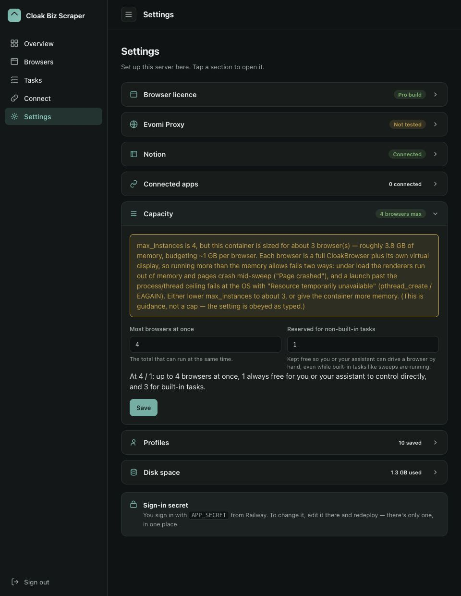
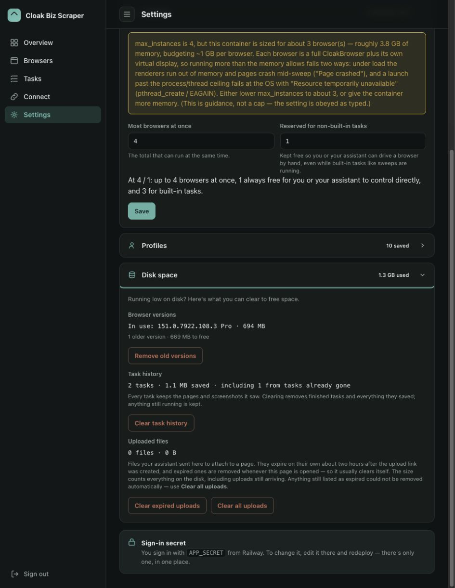

# Advanced controls

The default settings work for an initial test. Use this page when you need a fresh proxy exit,
more or fewer simultaneous browsers, a separate browser identity, or space back on the
Railway volume.

Complete [Set up Cloak Biz Scraper for your AI](set-up-scraper-for-ai.md) before changing
these controls. Change one setting at a time and run a small read-only test afterward.

## Rotate a profile's proxy exit

Each browser profile keeps a sticky residential proxy session. Rotate only after the current
exit is clearly blocked or you deliberately need a new session.

In the dashboard:

1. Close any browser currently using the profile.
2. Open **Settings → Profiles**.
3. On the intended profile, select **New proxy session**.
4. Launch the profile again. The fresh exit applies on the next launch; it cannot change a
   browser that is already open.

The profile keeps its cookies, logins, fingerprint, name, country, and region. Only its sticky
proxy session changes.

The equivalent AI prompt is:

```text
Use the Cloak Biz Scraper MCP. Close only the blocked browser instance you created. Call
new_proxy_session(name="Default") once, then call create_instance(profile="Default",
geoip=true) and retry the page once. Report the result. Do not rotate repeatedly.
```

Repeated rotation and retrying can waste proxy traffic or worsen a site block. A new IP also
does not bypass a login, CAPTCHA, paywall, or access rule.

## Set the number and mix of browsers

Open **Settings → Capacity**. The two values divide the browser pool:

| Setting | Meaning |
|---|---|
| **Most browsers at once** | Maximum number the server admits at one time |
| **Reserved for non-built-in tasks** | Slots kept available for manually or AI-driven interactive browsers |
| **Built-in task budget** | Calculated as maximum minus reserve; used by sweeps and archives |

For example:

| Maximum | Reserved | Built-in tasks can use | When to choose it |
|---:|---:|---:|---|
| 2 | 1 | 1 | Small host; one sweep while one interactive slot stays free |
| 4 | 1 | 3 | Balanced starting point for several sources |
| 4 | 2 | 2 | Two people or agents may browse while tasks run |

The reserve must be smaller than the maximum so built-in tasks retain at least one slot.
Select **Save** and read any memory warning shown by the app.

Higher concurrency requires enough CloakBrowser sessions, proxy bandwidth, and Railway
memory. A setting can be accepted while still being too large for the host. If browsers exit
unexpectedly or the app warns about memory, lower the maximum before increasing host size.
Start with one page per listing source and raise concurrency only after a stable run.



The screenshot shows development-server values and a real host-memory warning. Use the
numbers and status reported by your own deployment.

## Manage durable profiles

A profile is a saved browser identity. It keeps cookies, logins, local storage, fingerprint,
and its own exit geography across browser relaunches.

- Use **Default** for ordinary continuity. It cannot be renamed or deleted.
- Select **+ New profile** when you deliberately need a clean, separate identity.
- **Edit** changes a non-default name or future exit geography. Geography changes apply on
  the next launch.
- **New proxy session** changes the future exit IP while preserving saved browser data.
- **Clear** permanently erases cookies, logins, and cache but keeps the profile, location,
  and proxy session.
- **Delete** permanently removes a non-default profile and its saved data.

Close a profile's active browser before renaming, clearing, or deleting it. The Settings page
shows saved data size for each profile so you can find unusually large identities.

An AI can use `list_profiles`, `create_profile`, `update_profile`, `new_proxy_session`, and
`delete_profile`. Make destructive intent explicit. For example, do not ask an agent to
“clean profiles”; name the profile and whether you mean rotate, clear, or delete.

## Clean up the Railway volume

Open **Settings → Disk space** to inspect each category before deleting anything.



### Browser versions

Select **Remove old versions** to delete older browser builds while keeping the one the
server currently uses. If the app has not recorded the active build, open
**Browser licence**, select **Save & verify**, then return to Disk space.

### Task history

Every completed task can keep the pages and screenshots it saw. **Clear task history**
permanently removes finished tasks and their evidence; a task still running is kept. Review
failed runs before clearing because their screenshots and HTML are often the best diagnostic
record.

### Uploaded files

Uploads normally expire about two hours after their upload link was created, and the app
tries to remove expired files when the Settings page opens.

- **Clear expired uploads** keeps files whose links are still live.
- **Clear all uploads** removes every uploaded file, including one an agent may still need.

These cleanup actions cannot be undone. Do not clear all uploads during an active task.

## A conservative monthly maintenance routine

1. Check **Tasks → History** and save any evidence you still need.
2. Open **Settings → Disk space** and compare the three categories.
3. Remove old browser versions.
4. Clear task history only after the relevant failures have been reviewed.
5. Clear expired uploads; use **Clear all uploads** only when no upload task is active.
6. Review profile sizes and clear a profile only when you are willing to lose its cookies
   and logins.
7. Run the read-only connection test from the
   [scraper setup guide](set-up-scraper-for-ai.md#5-run-a-harmless-connection-test).
