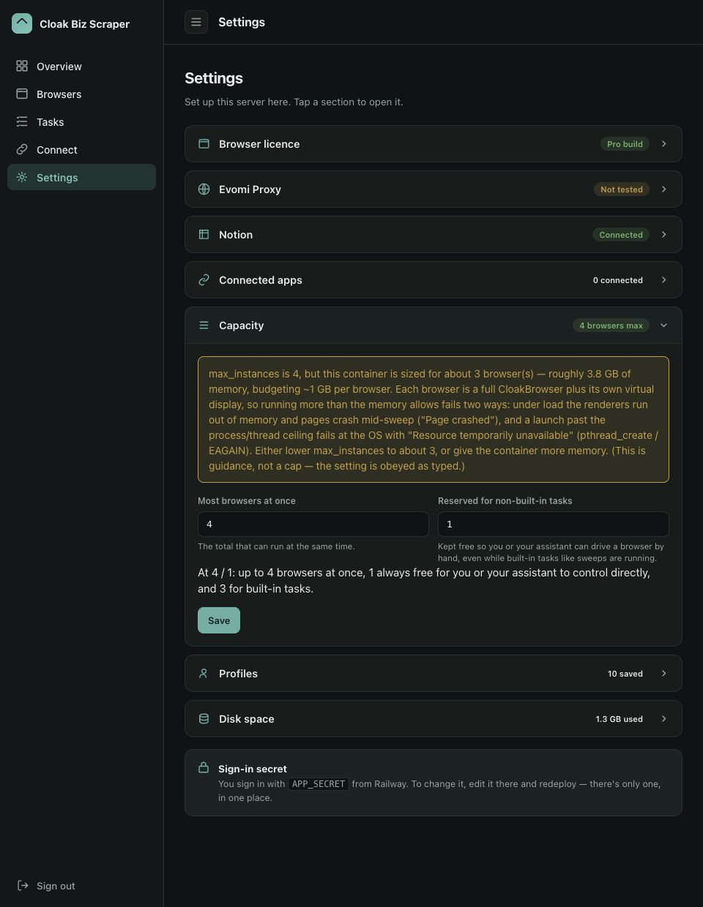
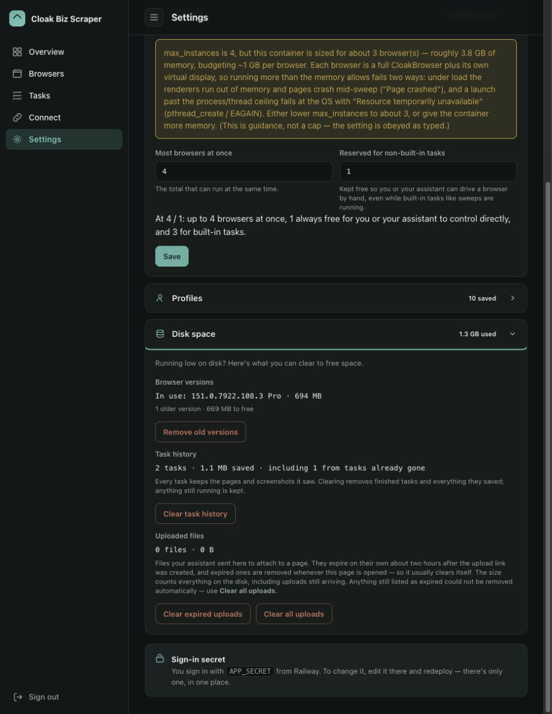

# Advanced controls

The default settings work for an initial test. Use this page when you need a fresh proxy exit,
more or fewer simultaneous browsers, a separate browser identity, listing sites other than
BizBuySell, a fix for a site that is read wrong, or space back on the Railway volume.

Complete [Set up Cloak Biz Scraper for your AI](set-up-scraper-for-ai.md) before changing
these controls. Change one setting at a time and run a small read-only test afterward.

## Rotate a profile's proxy exit

Each browser profile keeps a sticky residential proxy session. Rotate only after the current
exit is clearly blocked or you deliberately need a new session.

In the dashboard:

1. Close any browser currently using the profile.
2. Open **Settings → Profiles**.
3. On the intended profile, select **New proxy session**.
4. Launch the profile again. The fresh exit applies on the next launch; it cannot change a
   browser that is already open.

The profile keeps its cookies, logins, fingerprint, name, country, and region. Only its sticky
proxy session changes.

The equivalent AI prompt is:

```text
Use the Cloak Biz Scraper MCP. Close only the blocked browser instance you created. Call
new_proxy_session(name="Default") once, then call create_instance(profile="Default",
geoip=true) and retry the page once. Report the result. Do not rotate repeatedly.
```

Repeated rotation and retrying can waste proxy traffic or worsen a site block. A new IP also
does not bypass a login, CAPTCHA, paywall, or access rule.

## Set the number and mix of browsers

Open **Settings → Capacity**. The two values divide the browser pool:

| Setting | Meaning |
|---|---|
| **Most browsers at once** | Maximum number the server admits at one time |
| **Reserved for non-built-in tasks** | Slots kept available for manually or AI-driven interactive browsers |
| **Built-in task budget** | Calculated as maximum minus reserve; used by sweeps and archives |

For example:

| Maximum | Reserved | Built-in tasks can use | When to choose it |
|---:|---:|---:|---|
| 2 | 1 | 1 | Small host; one sweep while one interactive slot stays free |
| 4 | 1 | 3 | Balanced starting point for several sources |
| 4 | 2 | 2 | Two people or agents may browse while tasks run |

The reserve must be smaller than the maximum so built-in tasks retain at least one slot.
Select **Save** and read any memory warning shown by the app.

Higher concurrency requires enough CloakBrowser sessions, proxy bandwidth, and Railway
memory. A setting can be accepted while still being too large for the host. If browsers exit
unexpectedly or the app warns about memory, lower the maximum before increasing host size.
Start with one page per listing source and raise concurrency only after a stable run.



The screenshot shows development-server values and a real host-memory warning. Use the
numbers and status reported by your own deployment.

## Manage durable profiles

A profile is a saved browser identity. It keeps cookies, logins, local storage, fingerprint,
and its own exit geography across browser relaunches.

- Use **Default** for ordinary continuity. It cannot be renamed or deleted.
- Select **+ New profile** when you deliberately need a clean, separate identity.
- **Edit** changes a non-default name or future exit geography. Geography changes apply on
  the next launch.
- **New proxy session** changes the future exit IP while preserving saved browser data.
- **Clear** permanently erases cookies, logins, and cache but keeps the profile, location,
  and proxy session.
- **Delete** permanently removes a non-default profile and its saved data.

Close a profile's active browser before renaming, clearing, or deleting it. The Settings page
shows saved data size for each profile so you can find unusually large identities.

An AI can use `list_profiles`, `create_profile`, `update_profile`, `new_proxy_session`, and
`delete_profile`. Make destructive intent explicit. For example, do not ask an agent to
“clean profiles”; name the profile and whether you mean rotate, clear, or delete.

## TypeSafe Classifier (e.g. Jev)

The sweep reads BizBuySell with adapters written for its pages. Every other listing site —
a broker's own site, WebsiteClosers, Dealonomy, BizQuest, and so on — is read generically:
the app groups the page's links by their shape, and the **TypeSafe Classifier (e.g. Jev)**
decides which group is the list of businesses for sale, what each field on a card holds
(asking price, cash flow, revenue, location…), which statuses mean a business is gone, and
which link or button is the next page. It is a classifier, not a chat model: it answers
those questions and nothing else.

With a key saved:

- `scrape_listings` accepts any site's listings page, alongside BizBuySell URLs.
- Every sweep page, BizBuySell included, also gets a check that its cards read as business
  listings. A page where fewer than half do (or a page with no list on it at all) fails that
  source with screenshots, instead of filing garbage or reporting "no listings" — on the
  first page; on a later page the sweep stops there, keeps the pages before it, and says so
  in the result's `error`. On other sites a single card that doesn't read as a listing (a
  menu link, an ad) is left out, and the result's summary counts them. On BizBuySell the
  check judges the page only: a page that passes keeps every card the adapter read, and a
  first page that fails is retried from a new exit IP, like a block.
- A synced sweep can triage the rows it saves: pass your criteria as `triage_prompt` (see
  [Triage prompt](#triage-prompt)).

To set it up:

1. Create a key at [openrouter.ai/settings/keys](https://openrouter.ai/settings/keys) and
   add a few dollars of credit to the account.
2. Open **Settings → TypeSafe Classifier (e.g. Jev)**, paste the key into
   **OpenRouter API key**, leave **Model** as `jev-latest`, and select **Save & test**.
3. The section shows **Working** once OpenRouter answers.

Without a key, everything else works exactly as before: BizBuySell sweeps, Notion sync and
`archive_page`. A URL on another site is refused for that URL, with a message pointing at
this setting, and the rest of the batch still runs.

A key that stops working is caught before a sweep starts, with one quick question (at most
10 seconds). If OpenRouter rejects the key, the account is out of credits, or the service is
not answering, a call whose URLs all need the classifier is refused with that reason. In a batch that also has BizBuySell URLs, only
the other sites fail and the BizBuySell ones still run. A call with a `triage_prompt` is
refused whole, BizBuySell or not, because it would save rows it then could not decide.

Cost: a page takes a handful of small classifier requests — which list, the fields, the
statuses, the next page, the listing check — which together come to fractions of a cent
per page, billed to your OpenRouter account. Triage adds one request per new listing, and
two more for each one that is read on its detail page.

## Triage prompt

`scrape_listings(urls, max_pages, sync=true, triage_prompt="…")` saves the new listings
and then decides **REVIEW** or **REJECT** for each one, in the server, with the TypeSafe
Classifier (e.g. Jev). It needs `sync=true` and a working classifier key; a call without
either is refused before anything starts.

What it does, for every row the sweep inserted and every row it saw whose Bot Triage is
still blank:

1. It asks one question — your text, behind a fixed lead-in — about the card: title,
   location, asking price, cash flow, EBITDA, revenue and excerpt. **REJECT** is written
   straight away.
2. A **REVIEW** is checked again on the listing's detail page. If the page is the real
   listing, the same question is asked about the card plus the page: REVIEW appends the
   page as a Source Content section to the row (exactly as `archive_page` does) and then
   writes REVIEW; REJECT is written with nothing archived. If the page is a login or NDA
   wall, a removed listing or an error page, REVIEW is written as decided on the card, with
   nothing archived. If the page will not load at all, the row stays blank and is reported,
   and a later sweep tries it again.

A row that already has a Bot Triage value — the bot's or yours — is never judged again. A
sweep reads at most 25 detail pages: card REVIEWs past that stay blank, are counted in the
result's `triage.deferred`, and are read by the next sweep. An empty `triage_prompt` is the
same as leaving it out.

The decision goes to the **Bot Triage** column (Select or Text); a database without one
refuses the call. **Triage Reason** (e.g. `REVIEW · P(review)=0.91 · card + detail page`),
**Triaged At** and **Criteria Version** are written where the database has those columns,
or where **Settings → Notion** maps them to columns of your own — Triage Reason to an
existing "Why Review", say. Nothing else on the row is touched.

If the classifier stops answering part-way — or OpenRouter rejects the key or runs out of
credits — the sweep still completes (the rows are saved); the rows it had not decided stay
blank, the result's `triage.error` says why, and the next sweep that sees them decides them.
A question the classifier refuses for one listing only (an answer it can't give for that
card) fails that row alone, listed in `triage.failures`; the others are still decided.

Two sweeps that run at the same time never triage the same row twice: a row the other sweep
is already on is left to it and counted in `triage.in_flight`. And a page archived into a row
is written whole or not at all — if Notion refuses part of it, the part already written is
deleted again, so the next sweep (or `archive_page`) can file it cleanly.

**Writing the text.** The classifier judges; it cannot follow a procedure or write an
explanation. So:

- **State the reject conditions plainly**, one per line or bullet: "Reject restaurants,
  retail, franchises." "Reject if the asking price is below $1M or above $7.5M." Say what
  happens when a fact is missing ("Continue if the price is not disclosed") — the question
  already leans towards REVIEW when the evidence is missing or ambiguous.
- **Leave out tool and procedure steps** — "open the detail page", "call archive_page",
  "write a reason". The server does those; in the text they are only noise.
- **You do not need to compute the multiple.** When the asking price and the cash flow (or
  EBITDA) are each one exact amount, the card is given a `price_to_earnings_multiple` such
  as `4.25x`, so "Reject if asking price / SDE > 6.0" works as written.
- **Changing the text changes the Criteria Version**, the first 8 characters of its
  sha256, written on every row it decides. Rows decided under earlier text keep theirs;
  clear a row's Bot Triage to have the next sweep decide it again under the current text.

Keeping the criteria on a Notion page works well: the scheduled agent reads the page and
passes its text. `scripts/triage_prompt_from_notion.py <page id or URL>` prints a page's
plain text, the same way, to check what the classifier will be given; and
`scripts/eval_triage.py` runs a prompt over your Listings database's existing rows and
reports how often it agrees with the Bot Triage values already there, without writing
anything.

## Site overrides

A generic page is decided fresh every time, so a site that changes its layout is read by
its new layout. When one decision keeps coming out wrong for one site — the wrong list, a
field left empty, paging that stops early or never stops, sold listings kept — pin that
part in **Settings → Site overrides**. Anything you leave out is still decided by the
classifier.

The setting is a JSON list with one entry per site. It is saved only when every entry is
valid; otherwise the page shows where the problem is (a line and column for broken JSON,
or the override and field for a bad value) and keeps your text in the box. Leave it empty
for no overrides.

| Key | What it pins |
|---|---|
| `match` | The site: a host (`bizquest.com`, any page on it) or a URL prefix (`https://www.bizquest.com/businesses-for-sale-in-`). `www.` and http/https never matter; the longest match wins; `fcbb.com` does not cover `sfbay.fcbb.com`. Required. |
| `listing_links` | The link patterns that are the listings, exactly as a run reports them, e.g. `www.bizquest.com/business-for-sale/{*}/{*}` (`{*}` is any one path segment). Several patterns are read as one list. A single pattern of links that act on each card (`…/{*}/contact`, "Watch", "Unlock") is read through the listing links inside those cards. |
| `fields` | A card field — its label, or the slot key a run reports for an unlabelled one — mapped to what it holds, or to `ignore`. |
| `next_page` | How to reach the next page: see below. |
| `drop_status` | Status texts that mean a listing is gone, matched as case-insensitive substrings, e.g. `["sold", "under contract"]`. An empty list drops nothing. |

`next_page` takes one of three forms:

- **A URL with `{page}` in it** — `"https://example.com/listings?page={page}"` — for a site
  that pages by address. Page 2 is that URL with `2`, and so on.
- **`click:<css selector>`** — `"click:a.pagination-next"` — for a Next or Load more
  button with no address of its own.
- **`none`** — the site has one page; stop after page 1.

The values for `fields` are `title`, `location`, `asking_price`, `cash_flow_sde`, `ebitda`,
`revenue`, `status`, `category`, `description`, `listing_id`, `other` and `ignore`. The first
six fill the listing's columns; the rest stay in the listing's excerpt only. Money is always
kept exactly as the card printed it.

The easiest way to write one is to copy it. In **Tasks → History**, select **Details** on a
sweep of the site. Each generically read URL in `decisions` has:

- `pages` — what was decided on each page and by whom (`jev` or `override`): the chosen
  `listing_links` pattern with its confidence, each field's role and whether it was
  confident enough to use, the `next_page` rule (and, for a button, `clicked_by`: its
  `mark`, its `selector`, or a `re-probe` when the site had re-drawn it; for a link that
  pointed off the site, `refused` with where it went — it is not followed), and how many
  cards were dropped as sold.
- `legibility` — whether each page's cards read as business listings, which cards the
  classifier judged not to be listings, and how many of those were left out.
- `warning` — when the sweep stopped at a later page it could not use, which page and why
  (the pages before it were kept).
- `suggested_override` — a ready-to-paste override that pins what was decided on page 1.

Paste the `suggested_override` into the list, change the part that was wrong, delete the
parts you are happy to leave to the classifier, and save.

A site that pages by address, like WebsiteClosers (illustrative — copy the real values from
your own run's details):

```json
[
  {
    "match": "websiteclosers.com",
    "listing_links": ["www.websiteclosers.com/businesses/{*}/{*}"],
    "next_page": "https://www.websiteclosers.com/businesses-for-sale/page/{page}/",
    "drop_status": ["sold", "under contract"]
  }
]
```

A site with a script-only Next button and labelled card fields, like an FCBB office:

```json
[
  {
    "match": "https://sfbay.fcbb.com/silicon-valley",
    "next_page": "click:a.pagination-next",
    "fields": {
      "Asking Price": "asking_price",
      "Cash Flow": "cash_flow_sde",
      "Gross Revenue": "revenue",
      "Listing #": "ignore"
    }
  }
]
```

Overrides only change how a site is read, so they apply once a TypeSafe Classifier key is
saved. If a saved document ever stops being valid, sweeps of other sites are refused until
it is fixed or cleared; BizBuySell sweeps are never affected.

## Clean up the Railway volume

Open **Settings → Disk space** to inspect each category before deleting anything.



### Browser versions

Select **Remove old versions** to delete older browser builds while keeping the one the
server currently uses. If the app has not recorded the active build, open
**Browser licence**, select **Save & verify**, then return to Disk space.

### Task history

Every completed task can keep the pages and screenshots it saw. **Clear task history**
permanently removes finished tasks and their evidence; a task still running is kept. Review
failed runs before clearing because their screenshots and HTML are often the best diagnostic
record.

### Uploaded files

Uploads normally expire about two hours after their upload link was created, and the app
tries to remove expired files when the Settings page opens.

- **Clear expired uploads** keeps files whose links are still live.
- **Clear all uploads** removes every uploaded file, including one an agent may still need.

These cleanup actions cannot be undone. Do not clear all uploads during an active task.

### Downloaded files

Files your assistant downloaded with `download` are kept for about two hours so it — or
you, from the link it gave you — can fetch them. Expired ones are removed when the Settings
page opens.

- **Clear expired downloads** keeps files whose links still work.
- **Clear all downloads** removes every downloaded file; links already handed out stop
  working.

## A conservative monthly maintenance routine

1. Check **Tasks → History** and save any evidence you still need.
2. Open **Settings → Disk space** and compare the categories.
3. Remove old browser versions.
4. Clear task history only after the relevant failures have been reviewed.
5. Clear expired uploads and downloads; use **Clear all uploads** or **Clear all
   downloads** only when no task still needs those files.
6. Review profile sizes and clear a profile only when you are willing to lose its cookies
   and logins.
7. Run the read-only connection test from the
   [scraper setup guide](set-up-scraper-for-ai.md#5-run-a-harmless-connection-test).
