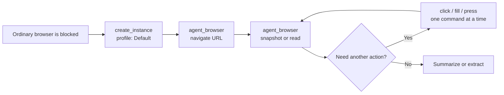

# Browse a page that blocks ordinary AI browsers

Use this guide when an AI's normal web tool cannot open a public page because the site blocks
datacenter traffic or browser automation.

Cloak Biz Scraper gives the AI a patched Chromium browser behind your residential proxy. The
AI must call the scraper's MCP tools explicitly. “Try the website again” is often too vague;
the agent may retry the same blocked browser.



## The shortest useful prompt

Replace the URL and the information you want:

```text
Use the Cloak Biz Scraper MCP, not your built-in browser, to open
https://example.com/page and tell me [what you need].

Call create_instance with profile="Default". Then use the returned instance_id with
agent_browser. Navigate to the URL, inspect the page with snapshot -i or read, and use
fresh snapshots after the page changes. Close only the browser instance you created for
this request when you are done.
```

This names both the MCP and the tools, which keeps the agent from substituting a generic web
browser.

## When the ordinary browser already failed

```text
The ordinary browser failed because the site blocked automated or datacenter traffic.
Do not retry that browser.

Use the Cloak Biz Scraper MCP:
1. Call create_instance(profile="Default", geoip=true).
2. Save the returned instance_id.
3. Call agent_browser(instance_id=<id>, command="navigate <URL>").
4. Call agent_browser with command="snapshot -i" or command="read" to inspect the page.
5. Use one agent_browser action per call. Take a fresh snapshot after navigation, clicks,
   form submissions, or other page changes.
6. Return the requested facts with the page URL. If the page still fails, report the actual
   error instead of claiming you read it.
```

## Useful `agent_browser` commands

The command string is one browser action. The agent calls the MCP tool again for the next
action.

| Goal | Command example |
|---|---|
| Open a page | `navigate https://example.com/page` |
| Inspect interactive elements | `snapshot -i` |
| Inspect the page with URLs | `snapshot -i -u` |
| Read the visible page | `read` |
| Click a snapshot reference | `click @e3` |
| Fill a field | `fill @e3 "California"` |
| Submit a form | `press Enter` |
| Confirm the final address | `get url` |
| Confirm the page title | `get title` |
| Read one element | `get text @e3` |
| Go back | `back` |
| Reload once | `reload` |
| Capture the visible page | `screenshot` |
| Capture the full page | `screenshot --full` |

Snapshot references such as `@e3` are temporary. The agent should take a new snapshot after
the page changes instead of guessing an old reference.

## A prompt for a search or multi-step page

```text
Use the Cloak Biz Scraper MCP for this browsing task.

Call create_instance(profile="Default", geoip=true), then use agent_browser with its
instance_id. Navigate to [START URL]. Take snapshot -i, fill or click the visible controls
needed to [GOAL], and take a fresh snapshot after every page change. Use get url to capture
the final filtered URL and return it to me with [THE FACTS I NEED].

Do not use the built-in web browser. Do not guess hidden controls or reuse stale element
references. Stop and tell me if the site requires a login, CAPTCHA, payment, or acceptance
of terms that needs me.
```

This is also the safest way to create a BizBuySell seed URL: have the cloaked browser apply
the filters, then read the final address with `get url`.

## Optional custom instructions

If the agent repeatedly retries its ordinary browser, add this to its personal or project
instructions:

```text
When I ask you to open a public website and ordinary web access is blocked by anti-bot or
datacenter-IP detection, use my connected Cloak Biz Scraper MCP.

Call create_instance with the durable profile "Default", then drive that instance with the
agent_browser tool. Use navigate, snapshot -i or read, and one action per tool call. Take a
fresh snapshot after page changes. Do not claim a page was read unless agent_browser returned
its content. Ask me to take over for login, CAPTCHA, payment, consent, or other human-only
steps. Close only instances you created for the current task.
```

Keep this instruction scoped to access failures. A normal browser is faster for pages that
already work, and unnecessary protected-browser traffic consumes proxy bandwidth.

## Save the page to Notion when you need a record

Browsing and archiving are different operations.

If an existing Notion page should hold a permanent copy, tell the agent:

```text
Use the Cloak Biz Scraper MCP tool archive_page with url=<PAGE URL> and
notion_page_id=<EXISTING NOTION PAGE ID>. Wait for it to finish. Then use the Notion MCP to
read the archived page body and confirm a Source Content section was appended.
```

`archive_page` takes roughly a minute, appends to the page, and does not edit its properties.
Do not call it twice just because it is slow: another successful call appends another copy.

## Logins, CAPTCHAs, and blocked IPs

The **Browsers** tab lets you watch the browser and take control when a site needs a human:


- The `Default` profile is durable. Its cookies and logins survive a browser relaunch, so use
  the same profile for continuity.
- Do not put passwords or one-time codes in prompts. Open the scraper's **Browsers** tab and
  take control of the live browser when a site needs you to sign in.
- CloakBrowser does not solve CAPTCHAs. Complete legitimate verification yourself.
- If a residential exit IP is blocked, close the current instance, call
  `new_proxy_session(name="Default")`, then create a new instance. Do this once and report
  the result; do not rotate in an aggressive loop.
- A browser closes after 15 minutes idle or 60 minutes total. If a CDP link expires, call
  `get_instance` or `list_instances` for a fresh link rather than launching duplicate
  browsers.

Use the browser only for public pages or sites you are authorized to access. Respect site
terms, access controls, rate limits, and paywalls.

## Verify the setup once

Ask the agent to perform a harmless read-only check:

```text
Use Cloak Biz Scraper to open https://example.com with profile="Default". Report the page
title and final URL, then close the instance you created. Also report whether the server says
the browser is using the configured residential proxy. Do not submit forms or save data.
```

Then repeat the check on a public page that previously blocked the ordinary browser. If it
still fails, open Cloak Biz Scraper **Settings** and retest the browser licence and proxy
before changing prompts.
