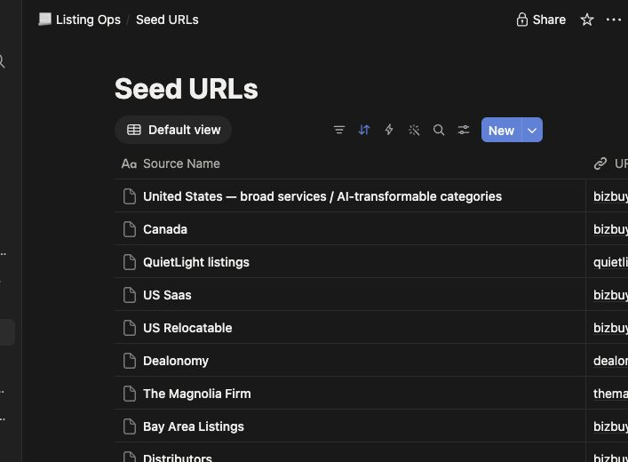

# Wake up to businesses worth reviewing

Cloak Biz Scraper turns saved business-marketplace searches into a daily AI workflow you
control. Every morning, your agent sweeps the search pages, applies your written filters,
archives promising listing pages into Notion, and leaves you a short review queue.

[Start the visual setup tutorial](set-up-daily-listing-watch.md){ .md-button .md-button--primary }
[View the open-source project](https://github.com/thisnick/cloak-biz-scraper){ .md-button }

## What you will build

1. **Seed URLs in Notion** hold the marketplace searches you want watched.
2. **Cloak Biz Scraper** opens those searches through CloakBrowser and your residential proxy.
3. **Claude or ChatGPT Work** runs the workflow on a morning schedule.
4. **Objective triage rules** reject only listings that clearly fail a written filter.
5. **`archive_page`** saves the full page into the listing's Notion page when the agent needs
   the details or wants to preserve the source.
6. **A morning report** links the listings marked `REVIEW` and reports failures honestly.

## Start with the outcome

The setup guide is written for business searchers rather than developers. It walks through
Railway deployment, Evomi credentials, CloakBrowser, both Notion connections, Claude and
ChatGPT MCP setup, seed-search capture, triage criteria, testing, and scheduling.

[Open the complete tutorial](set-up-daily-listing-watch.md){ .md-button .md-button--primary }

Already have the scraper connected? Use the [protected-site prompt guide](browse-protected-sites.md)
or copy the [daily agent runbook](prompts/listing-watch-runbook.md) into Notion.

## Verified against the real workflow

The guide was checked against the running Pro browser and residential proxy. A one-page
BizBuySell sweep returned 50 listings with `sync=false`. The archive tool then saved a
synthetic page under `Source Content`, and Claude read that archived body back through its
Notion connector without editing it.

See the [verification record](tutorial-verification.md) for the full test boundary.
