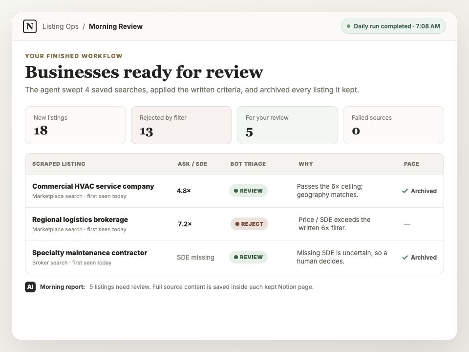
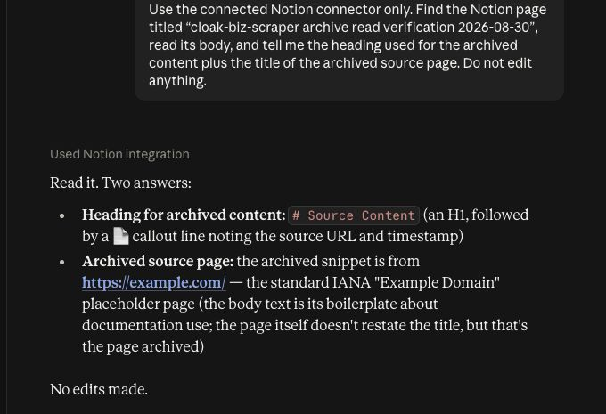

# Give your AI a browser that can reach protected websites

Cloak Biz Scraper is an open-source browser service you deploy yourself. It gives Claude or
ChatGPT a remote MCP connection to a patched Chromium browser running through your
residential proxy.

Set it up once, then use it for a scheduled business-listing watch or any authorized public
page that blocks an ordinary AI browser.

[Set up the scraper for AI](set-up-scraper-for-ai.md){ .md-button .md-button--primary }
[View the open-source project](https://github.com/thisnick/cloak-biz-scraper){ .md-button }

*One workflow you can build: a morning review queue. This illustrative sample uses fictional
listings; your queue will contain the businesses found by your saved searches.*

## First, connect the browser to your AI

The shared setup guide walks through the complete foundation:

1. deploy Cloak Biz Scraper on Railway;
2. get the CloakBrowser Pro key through its checkout email;
3. generate Evomi proxy credentials and split the copied string into the four required
   fields;
4. connect the scraper's `/mcp` URL to Claude or ChatGPT with OAuth; and
5. prove that the AI can call `create_instance` and `agent_browser` in a harmless test.

## Then choose a workflow

### Wake up to businesses worth reviewing

The listing tutorial adds Notion, reusable search-result URLs, objective triage rules, page
archiving, and a daily Claude or ChatGPT Work schedule. Each morning the agent calls
`scrape_listings`, filters new listings, calls `archive_page` for anything it keeps or cannot
decide from the summary, and leaves a review queue.

[Build the daily listing watch](set-up-daily-listing-watch.md){ .md-button .md-button--primary }

### Browse a page with anti-bot detection

The protected-site guide provides copy-and-paste prompts that tell the AI exactly which MCP
and tools to use. It covers one-page reads, multi-step searches, custom instructions,
archiving to Notion, CAPTCHAs, and a single bounded proxy rotation.

[Open the protected-site prompt guide](browse-protected-sites.md){ .md-button .md-button--primary }

## Watch and maintain it

- **[Monitor and take control](monitor-and-take-control.md)** explains the live preview,
  browser takeover, task history, saved evidence, and human login or CAPTCHA handoff.
- **[Advanced controls](advanced-controls.md)** explains proxy-session rotation, concurrent
  browser limits, the task versus interactive-session mix, durable profiles, and disk
  cleanup.
- **[Daily agent runbook](prompts/listing-watch-runbook.md)** is the exact operating procedure
  to copy into Notion for the scheduled listing workflow.

## Verified against the real workflow

The guides were checked against the running Pro browser and residential proxy. A one-page
BizBuySell sweep returned 50 listings with `sync=false`. The archive tool then saved a
synthetic page under `Source Content`, and Claude read that archived body back through its
Notion connector without editing it.

See the [verification record](tutorial-verification.md) for the test boundary and provider
documentation used before publication.
