# Wake up to a short list of businesses worth reviewing

This guide sets up a daily business-listing workflow for a searcher who does not want to
check the same marketplace pages by hand every morning.

## The outcome

At the end, you will have:

- a **Seed URLs** database in Notion that holds the searches you want watched;
- a **Listings** database where new results are deduplicated;
- a plain-language **Triage Criteria** page that holds your screening rules, and a
  **Listing Watch Runbook** that tells the scheduled agent what to do;
- a scheduled Claude or ChatGPT Work task that runs every morning;
- every new listing decided `REVIEW` or `REJECT` by the scraper against your criteria;
- full listing-page text archived inside the Notion pages marked for review; and
- a morning report with new, rejected, review, and failed-source counts.

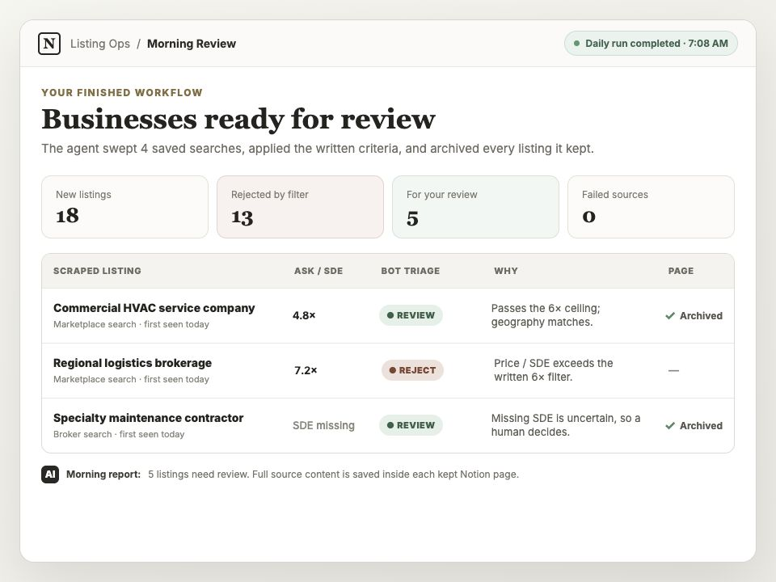

*Illustrative sample using fictional listings. Your morning review will contain the
businesses found by your saved searches.*

The triage is an initial filter. It rejects only listings that clearly break a written
rule, and sends ambiguous listings to you for review rather than pretending to perform full
diligence.

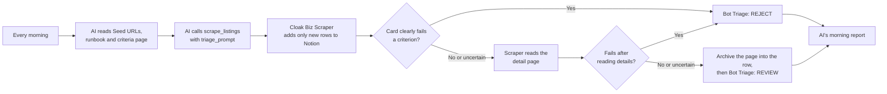
```mermaid
flowchart LR
    A[Every morning] --> B[AI reads Seed URLs,<br>runbook and criteria page]
    B --> C[AI calls scrape_listings<br>with triage_prompt]
    C --> D[Cloak Biz Scraper<br>adds only new rows to Notion]
    D --> E{Card clearly fails<br>a criterion?}
    E -->|Yes| F[Bot Triage: REJECT]
    E -->|No or uncertain| G[Scraper reads the<br>detail page]
    G --> I{Fails after<br>reading details?}
    I -->|Yes| F
    I -->|No or uncertain| J[Archive the page into the row,<br>then Bot Triage: REVIEW]
    F --> K[AI's morning report]
    J --> K
```

> **Who decides:** the scraper does, with the
> [TypeSafe Classifier (e.g. Jev)](advanced-controls.md#typesafe-classifier-eg-jev), when
> `scrape_listings` is given your criteria as `triage_prompt`. It records the decision on
> the row and appends each REVIEW listing's detail page to it as a Source Content section.
> The scheduled AI only starts the sweeps, waits for them, and reports. See
> [Triage prompt](advanced-controls.md#triage-prompt) for exactly what happens to each row.

## Before you start

This workflow builds on a working Cloak Biz Scraper connection.

1. Complete **[Set up Cloak Biz Scraper for your AI](set-up-scraper-for-ai.md)**.
2. Run its harmless connection test. Do not continue until your agent can call
   `server_info`, `create_instance`, and `agent_browser`, and the server reports a
   verified Pro browser and working residential proxy.
3. Save a [TypeSafe Classifier (e.g. Jev)](advanced-controls.md#typesafe-classifier-eg-jev)
   key under **Settings → TypeSafe Classifier (e.g. Jev)**. Triage needs it; a sweep asked
   to triage without a working key is refused before it starts.
4. Create or choose a [Notion](https://www.notion.com/) workspace where you can create an
   internal integration and databases.
5. Choose Claude or ChatGPT Work with scheduled tasks and the connector permissions
   described below.

The shared setup guide covers Railway deployment, the emailed CloakBrowser Pro key, Evomi
credentials, and the scraper MCP connection. This guide starts with the listing-specific
Notion workspace and daily workflow.

## 1. Set up Cloak Biz Scraper for AI

If you have not already done so, complete the
**[shared scraper setup guide](set-up-scraper-for-ai.md)**. It is the required first step for
both this listing workflow and protected-site browsing.

The connection test in that guide opens Example Domain through `create_instance` and
`agent_browser`. Passing it confirms that the deployment, Pro key, proxy, OAuth, and MCP
tool connection work before Notion is added.

## 2. Build the Notion workspace

Use three Notion objects. Keeping them separate makes the scheduled prompt short and lets you
change searches or screening rules without editing the schedule.

### A. Listings database

Cloak Biz Scraper can create the base database for you.

1. Go to [Notion integrations](https://www.notion.so/my-integrations) and create an internal
   integration for Cloak Biz Scraper.
2. Give it permission to read, insert, and update content. It does not need access to user
   information.
3. Copy the integration secret.
4. In Notion, create a page that will hold the databases. Open the page's `•••` menu, choose
   **Connections**, and add the integration. Share the original page or database, not a linked
   database view.

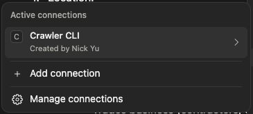

The integration name in the screenshot is an example. Your connection should use the name you
gave the Cloak Biz Scraper internal integration.

5. In Cloak Biz Scraper, open **Settings → Notion**, paste the secret, and select
   **Save & find my databases**.
6. Either choose an existing database and select **Use this database**, or choose the parent
   page and explicitly select **Create database**. The app never creates a database merely by
   verifying the connection.
7. Select **Verify & edit columns** and confirm every required field has a destination.

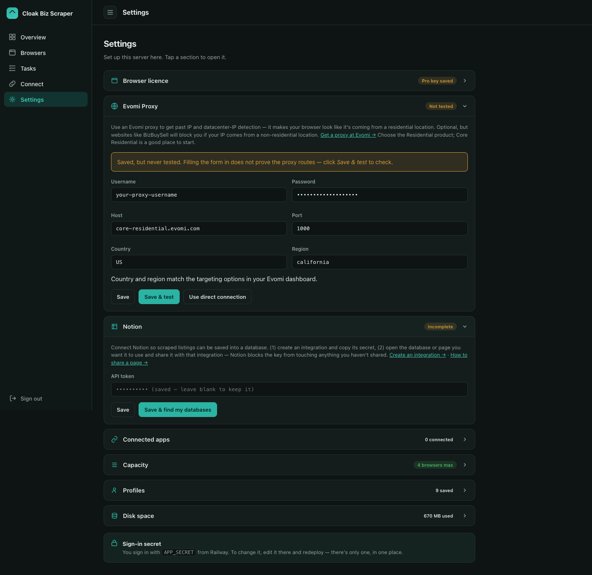

The app-created database includes the source URL, a normalized URL and listing ID for
deduplication, location, asking price, revenue, SDE/cash flow, EBITDA, and first-seen/sync
dates. Undisclosed or ambiguous money values may stay empty rather than being converted into
a misleading number.

A database the app creates also has the four triage columns. On a database you made
yourself, add them, or map them to columns you already have:

| Property | Type | Written by triage |
|---|---|---|
| `Bot Triage` | Select (or Text) | `REVIEW` or `REJECT`. Required for triage; empty until a sweep decides the row |
| `Triage Reason` | Text | What the decision was made on, e.g. `REVIEW · P(review)=0.91 · card + detail page` |
| `Triaged At` | Date | When the decision was made |
| `Criteria Version` | Text | The first 8 characters of the criteria text's fingerprint; it changes when the text does |

Triage writes these four and nothing else, and only on a sweep given a `triage_prompt`; an
ordinary sweep never touches them. Only `Bot Triage` is required. If your database already
has a column for one of the others under another name — a "Why Review" text column for the
reason, say — map it in **Settings → Notion → Verify & edit columns**, under **Written only
by triage**; a triage field with no column of its name and no mapping is simply not
written. A mapping set to "don't write" switches that field off; for `Bot Triage` that
switches triage off, and a sweep asked to triage is refused with that reason.

Add your own review columns alongside them:

| Property | Type | Recommended values or purpose |
|---|---|---|
| `Human Decision` | Select | `UNREVIEWED`, `CONTACT`, `PASS`, `RESEARCH` |
| `Human Notes` | Text | Your notes; nothing automated ever writes them |

Do not use the same field for the bot and the human. The app only writes its configured
listing fields and the triage fields above, so these remain yours.

Open **Settings → Edit properties** to add or review the database fields:

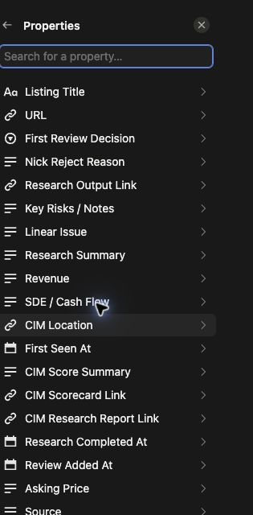

The live `Bot Triage` field is a Select with two final values. Keeping it binary makes the
morning filter predictable; an empty value means the row still needs triage.

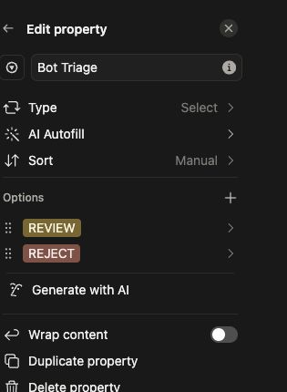

Create a database view named **Morning Review** filtered to `Bot Triage = REVIEW` and
`Human Decision is empty or UNREVIEWED`. Sort by `Triaged At`, newest first.

Create another view named **Needs Triage** for rows where `Bot Triage is empty` and
`Human Decision is empty or UNREVIEWED`. These are rows triage could not finish — a detail
page that would not load, or a run that was interrupted. The next sweep that sees such a
row in its search results decides it; one that never appears again stays here for you.

### B. Seed URLs database

Create a second database named **Seed URLs** with these properties:

| Property | Type | Purpose |
|---|---|---|
| `Source Name` | Title | A human name such as `California laundromats under $2M` |
| `URL` | URL | The complete filtered search-results URL |
| `Active` | Checkbox | Whether the schedule should sweep it |
| `Max Pages` | Number | Pages to sweep for this source; start with `1` |
| `Notes` | Text | Geography, expected filters, or troubleshooting notes |

The existing setup looks like this. Each row is one reusable search, and `Active` plus
`Max Pages` control the morning run without changing its scheduled prompt.

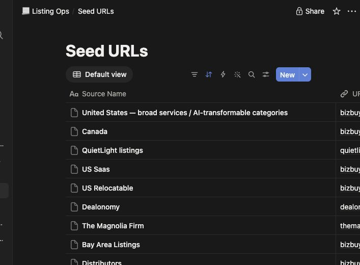

The built-in sweep reads BizBuySell search-results pages and BizBuySell broker profile
pages with its own adapter. Listings pages on other sites — a broker's own site, or a
marketplace such as WebsiteClosers or Dealonomy — can be seeds too once a
[TypeSafe Classifier (e.g. Jev) key](advanced-controls.md#typesafe-classifier-eg-jev) is
saved in Settings; without one, those seeds fail with a message pointing there. A seed must
be a page that lists many businesses: a single listing's page fails with "found no list of
businesses for sale" (on BizBuySell it is refused outright).

To make a seed:

1. Open BizBuySell (or the other listing site) and run a normal search.
2. Apply the marketplace's useful filters first: location, asking-price range, category, and
   any other filter it supports.
3. Copy the resulting URL from the address bar.
4. Open the copied URL in a new tab and confirm the filters survived. If the page reset, the
   URL is not a usable seed yet.
5. Add one row to **Seed URLs**, set `Active`, and start with `Max Pages = 1`.

Store URLs here instead of pasting them into the scheduled prompt. A database gives you an
audit trail and lets you pause or change a source without recreating the schedule.

Create an **Active Seeds** saved view filtered to `Active is checked`. The runbook uses this
view through the Notion MCP, which avoids needing cross-database SQL access on a paid Notion
AI plan.

### C. Triage Criteria and the Listing Watch Runbook

Create two normal Notion pages:

- **Triage Criteria** holds your screening rules and nothing else. The agent passes its text
  to `scrape_listings` as `triage_prompt`, word for word, and the scraper judges every new
  listing against it.
- **Listing Watch Runbook** is the canonical prompt the agent reads fresh every morning: which
  pages to read, which calls to make, and what to report.

Keep them apart: the classifier that reads the criteria judges listings, and cannot follow
steps such as "open the detail page" — in the criteria they are only noise.

Put objective filters first. A useful rule is:

> Reject when both asking price and SDE/cash flow are disclosed, positive numbers and
> `asking price ÷ SDE > 6`. A value of `6` passes this rule. If either number is missing or
> unclear, this rule alone cannot reject the listing.

Write each criterion so another person would reach the same result. Good initial-filter rules
include a maximum asking price, minimum SDE, allowed or excluded locations, excluded business
models, and whether seller financing is required. Avoid rules such as “good business,” “looks
interesting,” or “probably manageable.” Save subjective ranking for human review.

The scraper applies them this way:

- **REJECT** only when a written criterion clearly fails.
- **REVIEW** when the listing passes, the evidence conflicts, or a required fact is
  missing.
- A card-level reject needs no archive.
- Every listing marked **REVIEW** whose detail page could be read has that page archived
  first.

You do not need to compute ratios: when the asking price and cash flow are both exact
amounts, the scraper hands the classifier the price-to-earnings multiple. See
[Triage prompt](advanced-controls.md#triage-prompt) for more on writing the text.

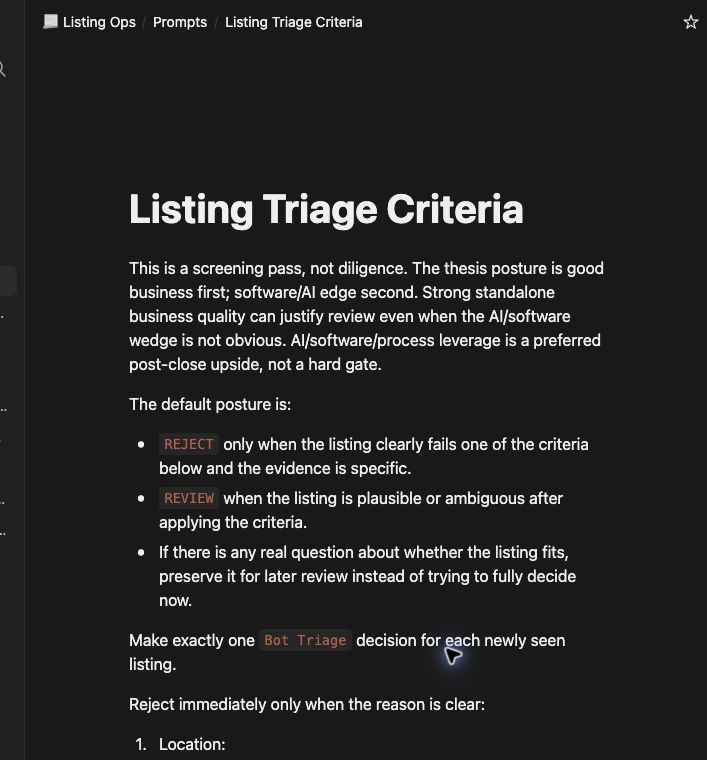

You do not need a version line: every decided row records a **Criteria Version** computed
from the text itself, so a row always says which wording judged it.

Copy the **[complete runbook template](prompts/listing-watch-runbook.md)** into the runbook
page, and its criteria template into the Triage Criteria page. It contains the daily
procedure, exact MCP tools, and report format. Replace its bracketed URLs and criteria, and
delete any criterion you are not using.

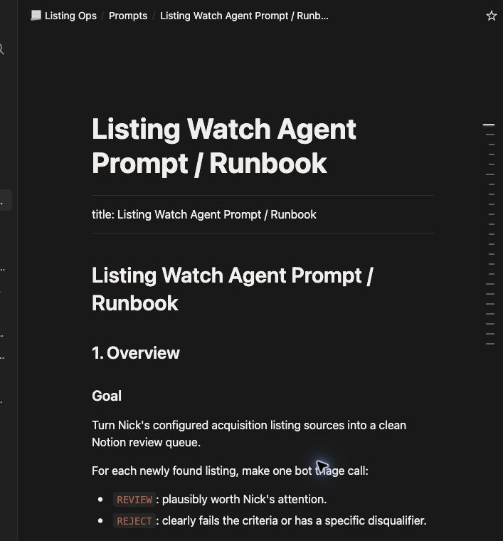

## 3. Connect Notion to the same AI

The shared setup guide already connected the **Cloak Biz Scraper MCP**. This listing workflow
also needs the **Notion MCP** to read Seed URLs, the runbook, and the Triage Criteria page.
The scraper records the triage decisions itself, through its own integration.

Add Notion's hosted MCP at `https://mcp.notion.com/mcp` using Streamable HTTP and OAuth, or use
the official Notion connector when your agent offers it. Sign in and authorize the intended
Notion workspace. The hosted MCP can inherit the content access of your Notion user account;
this differs from the scraper's page-scoped internal integration. Use an appropriately
scoped account and inspect the requested permissions. Confirm that the agent can:

1. read a row from **Seed URLs**;
2. read **Listing Watch Runbook**;
3. read **Triage Criteria**; and
4. read a listing page's body.

To see an archived body the way you will read REVIEW rows, call `archive_page` on a
synthetic page, then ask the agent to read that same Notion page with the **Notion**
connector. It should find the `Source Content` heading and the captured page text. Here
Claude read a synthetic page after the scraper appended the Example Domain capture:

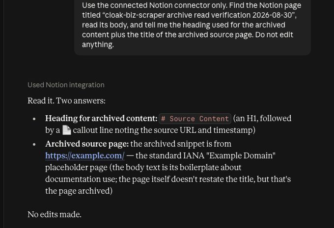

## 4. Choose the scheduled agent

Use the same Claude or ChatGPT account where you connected Cloak Biz Scraper and Notion.

### Claude

Scheduled tasks run through Claude Cowork. Open **Scheduled → New task**. Scheduled Cowork
tasks can use remote connectors while your computer is asleep. Availability depends on the
paid plan and current rollout.

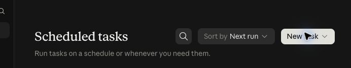

Enable both **Cloak Biz Scraper** and **Notion** for the task when Claude asks which connectors
it may use.

### ChatGPT Work

ChatGPT Work is available on individual paid plans as well as managed workspaces, subject to
rollout. Plus and Pro users can create scheduled tasks from **Scheduled** or ask Work to
create one. Open **Scheduled**, select **Work**, and use the short bootstrap prompt in Step 6.

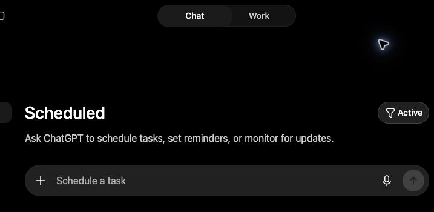

Add the official Notion plugin and authorize the workspace that holds Seed URLs, Listings,
and the runbook. The shared scraper setup guide covers the separate custom MCP connection.

OpenAI documents plan-dependent limits for raw custom MCP actions. This workflow needs action
tools because `scrape_listings` starts a server task that writes to Notion.
Before scheduling, prove compatibility on the actual account:

1. Ask Work to call `server_info`.
2. Ask Work to call `scrape_listings` on one seed with `max_pages=1` and `sync=false`.
3. Poll with `get_scrape_listing_results` until it completes.
4. Confirm the tools were called instead of being replaced with ordinary web browsing.

If an action tool is absent or blocked, that account cannot yet run the raw custom-MCP
workflow unattended. Use Claude or a ChatGPT plan and connection method that exposes the
required actions.

## 5. Run one source manually before scheduling it

Tell the agent:

```text
Use the Cloak Biz Scraper MCP for this test. Do not use ordinary web browsing.

1. Call scrape_listings with this one BizBuySell search-results URL, max_pages=1,
   and sync=false.
2. Save its job_id.
3. Call get_scrape_listing_results with that exact job_id every few seconds until the
   status is completed or failed.
4. Report the source status, listing count, and any error. Do not write to Notion.
```

This tests the browser, proxy, URL, and scraper without touching the Listings database.

The successful result appears in **Tasks → History** with a listing count. Failed attempts
remain visible so you can open their evidence rather than guessing whether the proxy, browser,
or source page failed. This real one-page test returned 50 listings with `sync=false`:

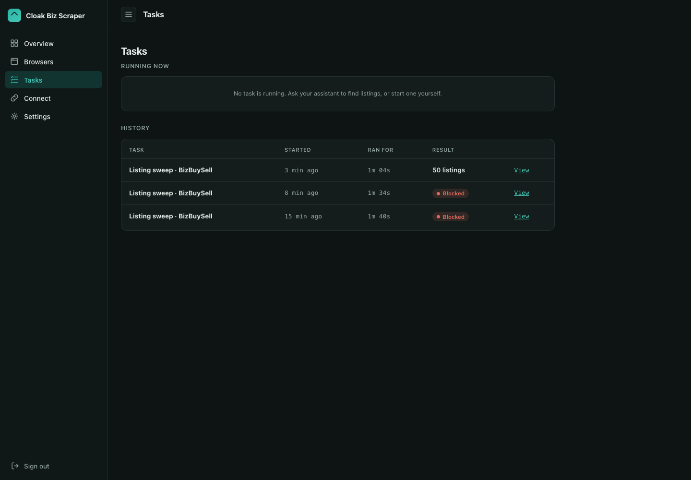

Next, run one controlled sync:

```text
Use the Cloak Biz Scraper MCP. Call scrape_listings for this one verified search-results
URL with max_pages=1 and sync=true. Poll get_scrape_listing_results with its job_id until
completed or failed. Tell me how many rows were newly inserted, already existed, and
failed. Do not archive anything during this test.
```

With `sync=true`, the completed `listings` array contains **only rows newly inserted by that
run**. Each new row carries `synced_row_id`, the id of its Notion page. Existing rows are
counted in `synced.existing` and omitted from the array; on them only `Last Synced At` and
`Excerpt` are refreshed.

Finally, run one triaging sweep. Paste your Triage Criteria text where shown:

```text
Use the Cloak Biz Scraper MCP. Call scrape_listings for this one verified search-results
URL with max_pages=1, sync=true, and triage_prompt set to exactly this text:

<paste the Triage Criteria page's text>

Poll get_scrape_listing_results with its job_id until completed or failed. Report the
triage counts, each REVIEW listing, and anything in triage.failures or triage.error.
```

Open a few of the new rows in Notion: each has a Bot Triage value and a Triage Reason, and
each REVIEW row whose page could be read has a Source Content section.

## 6. Save the daily bootstrap prompt

The long operating rules belong in the Notion runbook. The scheduled task should contain a
short bootstrap prompt that points to the live Notion pages and names the exact tools.

Replace the bracketed references, then save this short prompt as the scheduled task's
instructions. The detailed procedure stays in the Notion runbook, not in two separate copies:

```text
Run my daily business-listing watch.

Canonical sources:
- Notion page: [Listing Watch Runbook]
- Notion database: [Seed URLs]
- Notion database: [Listings]

Read the current runbook first using the Notion MCP, then execute its procedure. Pass the
Triage Criteria page's text to the Cloak Biz Scraper MCP tool scrape_listings as
triage_prompt, and collect results with get_scrape_listing_results, exactly as the runbook
specifies. Never use ordinary web browsing as a substitute, edit triage or human-review
fields yourself, or hide a failure.

End with the runbook's morning report and links to the listings ready for my review.
```

Keep URLs out of this prompt. The agent reads the live Seed URLs database each time, so the
database stays the source of truth.

## 7. Schedule the morning run

Choose a time after the marketplaces normally publish overnight changes. Start with one run
per day and one page per source until proxy traffic and review volume are predictable.

### Claude Cowork

1. Open **Scheduled → New task**.
2. Paste the bootstrap prompt.
3. Name it `Daily business listing watch`.
4. Choose a daily morning schedule and confirm the time zone.
5. Select an approval mode that lets the known scraper and Notion updates run unattended if
   your account permits it. Do not grant blanket approval to unrelated tools.
6. Save it, then use **Run now** once while watching the tool calls.

### ChatGPT Work

1. Open **Work**, create the task from the bootstrap prompt, and connect the required Notion
   and Cloak Biz Scraper app/plugin when the interface asks.
2. Open **Scheduled** and make it a daily morning task. Confirm the time zone and notification
   settings.
3. Run it once manually. Check that it called `scrape_listings` with `sync=true` and your
   criteria as `triage_prompt`, polled `get_scrape_listing_results` until each sweep
   finished, and reported the triage counts and failures.
4. Open the next scheduled result from **Scheduled**. A task that pauses for approval is not
   yet an unattended morning workflow; narrow or persist the necessary permissions where the
   product allows it.

## 8. Review the first three runs

For the first few mornings, compare the report with the task history in Cloak Biz Scraper and
the new Notion rows.

Check that:

- every source used the URL and page limit stored in Notion;
- `new + existing` is plausible and duplicates were skipped;
- every `REVIEW` page contains one `Source Content` section, unless its reason says the
  detail page was not readable;
- every decided row has a Triage Reason and the Criteria Version of your current text;
- the REJECTs you spot-check really fail a written criterion;
- human fields remain untouched; and
- failures appear in the report instead of disappearing.

Adjust one objective rule at a time; the Criteria Version changes with the text on its own.
Do not try to make triage "more selective" without writing the exact rule you want.

## Troubleshooting

### The marketplace opens in a normal browser and gets blocked

Tell the agent to use the **Cloak Biz Scraper MCP** and the exact tools named in the prompt.
See [Browse pages that block ordinary AI browsers](browse-protected-sites.md).

### Cloak Biz Scraper also reports “blocked by the site”

Confirm the app is actually running a Pro binary and reports a residential proxy location.
Wait a few minutes and retry one `sync=false` page once; a transient edge block can clear.
The scraper already uses new exit IPs during its bounded anti-bot retries, so do not launch an
aggressive retry loop. Review the task's saved screenshot and HTML evidence. Anti-bot systems
change, and the correct browser/proxy setup does not guarantee every request will be accepted.

### The sweep returns a job ID but no listings

That first response is expected. `scrape_listings` is asynchronous. The agent must poll
`get_scrape_listing_results` with the same job ID.

### A listing was not returned after a synced sweep

With `sync=true`, listings already present in Notion are counted as existing and omitted from
the returned `listings` array. On the existing row the scraper refreshes only `Last Synced At`
and `Excerpt` (from the live card); every other column is left as it was.

### A row stays blank in Needs Triage

Read the sweep's `triage.failures`: each blank row is listed with its URL and why it could
not be decided — most often a detail page that would not load. The next sweep that sees the
row tries again. If `triage.error` is set instead, triage stopped part-way (for example, the
classifier stopped answering); every row it had not reached stays blank until a later sweep.
A sweep also reads at most 25 detail pages: when more listings pass the card check than that,
`triage.deferred` counts the rest, which stay blank until the next sweep reads them. A row
another sweep was triaging at the same moment is counted in `triage.in_flight` and decided by
that sweep.

### Archive succeeded, but the AI still cannot quote the page

Neither `archive_page` nor a triaging sweep returns the archived content; they return
status and counts. The AI must use the Notion MCP to read the body of the listing page.

### The Notion database does not appear in the scraper

Share the original database or a parent page with the internal integration, then choose
**Save & find my databases** again. Sharing only a linked view may not expose the source.

### A CAPTCHA appears

CloakBrowser reduces avoidable bot challenges; it does not solve CAPTCHAs. Let the user take
control of the live browser when a site legitimately asks for human verification.

## Documentation checked for this guide

Verified on 2026-08-30 against the repository's MCP and REST implementations and these
provider documents:

See the separate **[verification record](tutorial-verification.md)** for live test results and
the authenticated product checks completed before publication.

- [CloakBrowser pricing and licence checkout](https://cloakbrowser.dev/)
- [Railway Serverless](https://docs.railway.com/deployments/serverless)
- [Evomi proxy instructions](https://docs.evomi.com/proxy-instructions/) and [Core Residential endpoint](https://docs.evomi.com/public-api/endpoints/default/)
- [Create a Notion integration](https://www.notion.com/help/create-integrations-with-the-notion-api) and [working with Notion databases](https://developers.notion.com/guides/data-apis/working-with-databases)
- [Connect to Notion MCP](https://developers.notion.com/guides/mcp/get-started-with-mcp) and [Notion MCP tools](https://developers.notion.com/guides/mcp/mcp-supported-tools)
- [Claude remote MCP connectors](https://support.claude.com/en/articles/11175166-get-started-with-custom-connectors-using-remote-mcp) and [Claude scheduled tasks](https://support.claude.com/en/articles/13854387-schedule-recurring-tasks-in-claude-cowork)
- [ChatGPT Work](https://openai.com/chatgpt-work/), [ChatGPT scheduled tasks](https://help.openai.com/en/articles/10291617), and [ChatGPT MCP plan limits](https://help.openai.com/en/articles/12584461)
