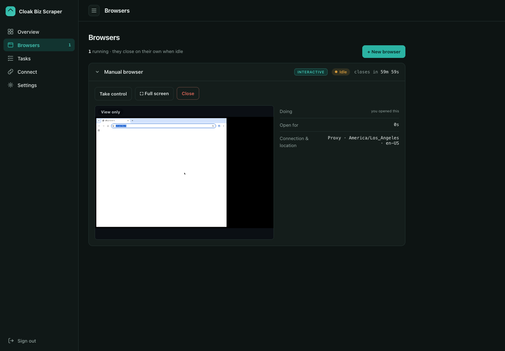
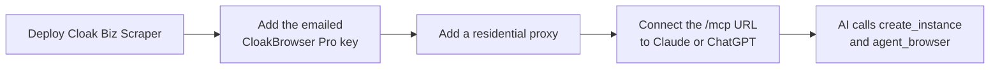
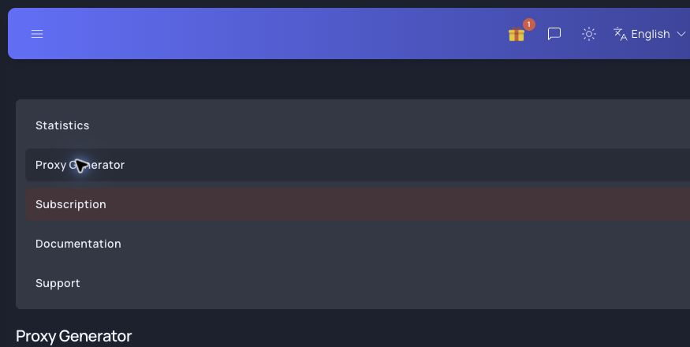
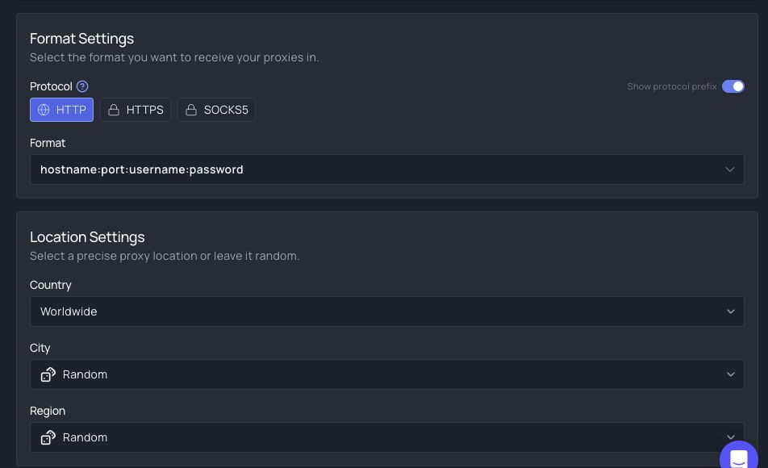
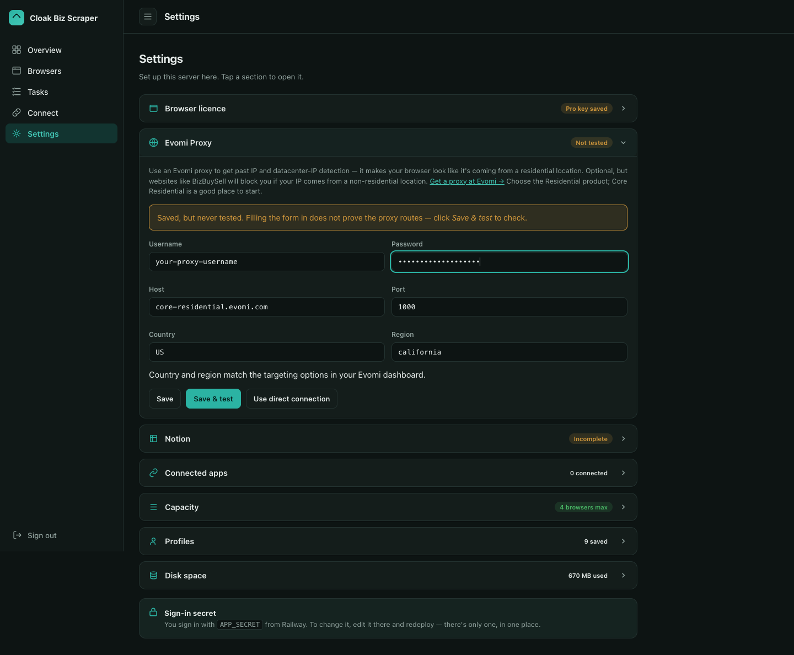
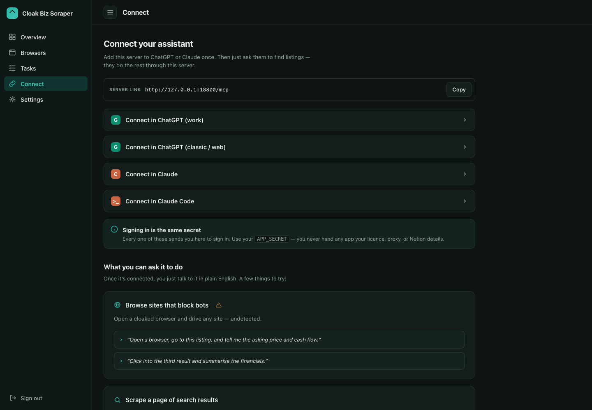
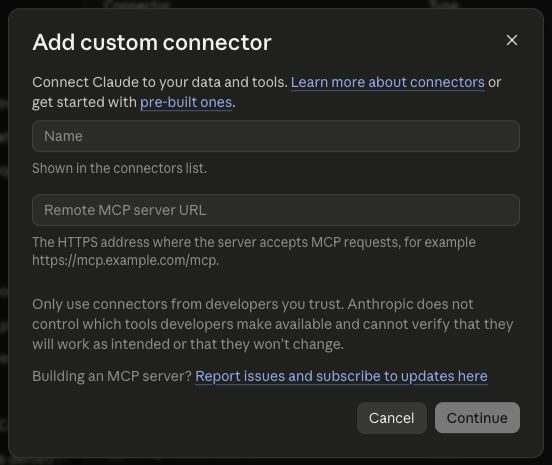
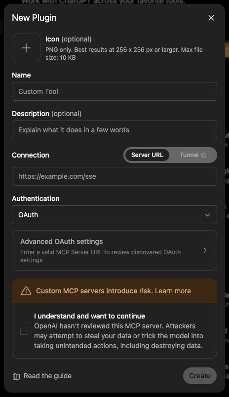

# Set up Cloak Biz Scraper for your AI

Complete this guide once. At the end, Claude or ChatGPT can launch and operate a cloaked
browser through MCP, using infrastructure and accounts you control.



You can then choose what the browser does:

- [build a scheduled business-listing watch](set-up-daily-listing-watch.md);
- [open a public page that blocks an ordinary AI browser](browse-protected-sites.md); or
- give the agent another browsing task with the prompt pattern at the end of this page.



## Before you start

You need:

1. A Railway account for hosting.
2. A paid [CloakBrowser](https://cloakbrowser.dev/) licence. The Pro key is sent by email
   after checkout; it does **not** come from a browser manager.
3. A residential proxy account. This guide uses
   [Evomi Core Residential](https://evomi.com/).
4. Claude or ChatGPT with support for a custom remote MCP connection.

The project is open source, but hosting, proxy traffic, CloakBrowser, and AI usage may cost
money. Check each provider's current plan before subscribing.

## 1. Deploy the project on Railway

1. Open the project's
   [one-click Railway template](https://railway.com/deploy/a7IwW8?referralCode=aXB6nz&utm_medium=integration&utm_source=template&utm_campaign=generic).
2. Deploy the template and wait for the service to become healthy.
3. In Railway, open **Settings → Deploy → Serverless**, enable it, then redeploy. The new
   setting applies to the newly deployed container.
4. Open **Variables** and copy `APP_SECRET`. Treat it as a password.
5. Open the public Railway URL and sign in with `APP_SECRET`.

Railway creates a persistent `/data` volume for settings, browser profiles, and recent task
history. Never put `APP_SECRET`, the browser key, or proxy credentials in an AI prompt, issue,
or screenshot.

### Watch the deployment walkthrough

<video controls playsinline preload="metadata" style="width: 100%; border-radius: 10px;">
  <source src="https://github.com/user-attachments/assets/3c86899d-9f1b-4946-b1ca-4b11a53514b5" type="video/mp4">
  Your browser cannot play the embedded video. Open the
  <a href="https://github.com/user-attachments/assets/3c86899d-9f1b-4946-b1ca-4b11a53514b5">deployment walkthrough on GitHub</a>.
</video>

*This video shows the Railway deployment and first launch. It does not configure the
residential proxy or Notion. Complete the proxy setup in Step 3 below before testing
protected sites. If you are building the daily listing workflow, its
[Notion setup](set-up-daily-listing-watch.md#2-build-the-notion-workspace) comes afterward.*

## 2. Get and add the CloakBrowser Pro key

1. Open the official [CloakBrowser website](https://cloakbrowser.dev/) and find its pricing.
2. Choose a plan with enough concurrent browser sessions for your expected workload and
   complete checkout with an email address you can access.
3. Follow the instructions in the purchase email to obtain the licence key. Check spam and
   the address on the receipt if the message does not arrive.
4. In Cloak Biz Scraper, open **Settings → Browser licence**.
5. Paste the emailed key. Leave the browser version blank to use the current build, then
   select **Save & verify**.

The verification must report a working Pro build before you continue. The key is supplied by
CloakBrowser's checkout email flow; the CloakBrowser Manager app is not part of this setup.

## 3. Add the Evomi residential proxy

### Generate the credentials

1. Create an [Evomi](https://evomi.com/) account and activate **Core Residential** traffic.
2. Sign in at [my.evomi.com](https://my.evomi.com/). Under **My Products**, open
   **Core Residential**, then select **Proxy Generator**.



3. Under **Format Settings**, choose **HTTP** and the host-first format
   `hostname:port:username:password`. Start with **Worldwide**; the scraper can add its own
   country and region selection.



4. Select Evomi's copy button. It copies one complete formatted string, not a separate
   username and password. Split the copied value into the four scraper fields:

   ```text
   core-residential.evomi.com:1000:YOUR_USERNAME:YOUR_PASSWORD
   | proxy host               |port| username   | password
   ```

   Remove an initial `http://` if Evomi included it. The first segment is **Proxy host**,
   the second is **Proxy port**, the third is **Proxy username**, and everything after the
   third colon is **Proxy password**.

### Save and test it

1. In Cloak Biz Scraper, open **Settings → Evomi Proxy**.
2. Enter the host, port, username, and password in their separate fields. The current Core
   Residential endpoint uses host `core-residential.evomi.com` and HTTP port `1000`; use
   the values shown in your Evomi dashboard if they change.
3. Choose the country and optional region where the browser should appear.
4. Select **Save & test**. Continue only when the test shows that traffic is leaving through
   the residential proxy.



If the proxy is incomplete or rejected, the scraper fails visibly instead of silently using
the Railway server's datacenter IP. If credentials are exposed, use **Reset Proxy Key** in
Evomi and replace them in the scraper.

## 4. Connect the scraper MCP to your AI

Open Cloak Biz Scraper's **Connect** tab. Copy the public MCP URL, which ends in `/mcp`:



The screenshot shows a local development address. Your AI needs the public HTTPS URL of your
Railway deployment:

```text
https://your-server.up.railway.app/mcp
```

The connection uses OAuth. When Claude or ChatGPT redirects you to your own scraper, enter
`APP_SECRET` on that scraper authorization page and approve the connection. Do not paste the
secret into a chat prompt.

### Claude

1. Open **Customize → Connectors**.
2. Select **Add → Add custom connector**.
3. Name it `Cloak Biz Scraper`, paste the public `/mcp` URL into **Remote MCP server URL**,
   and continue.
4. Complete authorization on your scraper's page.



### ChatGPT Work

ChatGPT Work is available on individual paid accounts as well as managed workspaces, subject
to rollout. In the current individual-account interface:

1. Open **Plugins → Create app**.
2. Enter `Cloak Biz Scraper`, select **Server URL**, paste the public `/mcp` URL, and keep
   **Authentication** set to **OAuth**.
3. Read the custom-server warning. Acknowledge it only when the URL is your own deployment,
   then create and authorize the app.



Custom MCP action availability varies by ChatGPT plan and product rollout. A connection is
not proven until the tool calls in the next step work. If the AI can read `server_info` but
cannot call action tools, that account cannot yet use the raw custom-MCP workflow; use a plan
with full MCP actions or Claude.

## 5. Run a harmless connection test

Paste this prompt into the AI that has the new connection:

```text
Use my connected Cloak Biz Scraper MCP for this test. Do not use your built-in browser.

1. Call server_info and confirm that the server reports a verified Pro browser and a
   working residential proxy. Do not reveal any credential values.
2. Call create_instance with profile="Default" and geoip=true. Save the instance_id.
3. Call agent_browser with that instance_id and command="navigate https://example.com".
4. Call agent_browser again with command="get title", then with command="get url".
5. Report the title and final URL.
6. Call close_instance for only the instance you created.

If a tool is missing or a call fails, report the exact tool and error. Do not substitute
ordinary web browsing and do not claim the test passed.
```

The expected title is `Example Domain`. During the run, the browser appears on the scraper's
**Overview** and **Browsers** tabs.

The most useful connected tools are:

| Job | MCP tool |
|---|---|
| Check configuration and capacity | `server_info` |
| Launch a browser | `create_instance` |
| Navigate, read, click, fill, or take a screenshot | `agent_browser` |
| Inspect or refresh links for open browsers | `list_instances`, `get_instance` |
| Close a browser | `close_instance` |
| Give a profile a new exit IP on its next launch | `new_proxy_session` |
| Sweep supported listing-search pages | `scrape_listings`, then `get_scrape_listing_results` |
| Save a page's readable content into an existing Notion page | `archive_page` |

## 6. Give the AI an explicit browsing prompt

For any browsing task, name the connection and the two tools. This prevents the agent from
retrying its ordinary browser:

```text
Use the Cloak Biz Scraper MCP, not your built-in browser, to open [URL] and [GOAL].

Call create_instance(profile="Default", geoip=true), save its instance_id, and use
agent_browser with that instance. Navigate to the URL, inspect it with snapshot -i or read,
and take a fresh snapshot after each page change. Report the final URL and requested facts.
Close only the instance you created when you are done. If the page needs a login, CAPTCHA,
payment, or consent from me, stop and ask me to take control.
```

Next, read [Browse a page that blocks ordinary AI browsers](browse-protected-sites.md) for
more prompt examples. Use [Monitor and take control](monitor-and-take-control.md) to watch a
run or finish a human-only step, and [Advanced controls](advanced-controls.md) to tune proxy
sessions, capacity, profiles, and disk usage.

## If the test fails

- **No MCP tools appear:** reconnect the server so the client refreshes its cached tool list.
- **The MCP URL cannot be reached:** use the Railway public HTTPS URL, not `127.0.0.1`.
- **OAuth returns to the scraper:** that is expected; enter `APP_SECRET` only on your own
  scraper's page.
- **The browser licence fails:** re-copy the key from CloakBrowser's email and use
  **Save & verify**.
- **The proxy test fails:** regenerate or reset the Evomi proxy key, split the copied string
  into four fields, and use **Save & test** again.
- **The site still blocks the browser:** inspect the saved evidence, wait before one bounded
  retry, and see the protected-site and advanced-controls guides. No browser or proxy can
  guarantee access to every page.

This setup was checked against the repository's live MCP implementation and the provider
flows listed in the [verification record](tutorial-verification.md).
